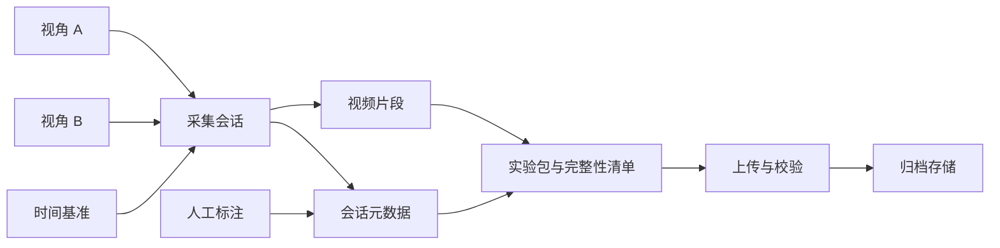
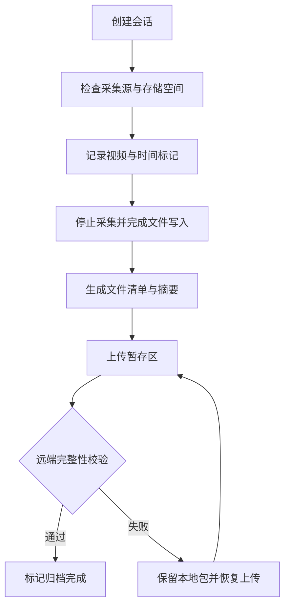

# Dual-Camera Capture — 双路采集与数据交付

**关注问题：怎样让两路视频、操作标注和最终归档能够相互对应，并在上传失败时恢复？**

项目范围沿用已公开介绍：第一人称与俯视双路采集、同步标注、实验包与 NAS 校验上传。本文展示通用数据组织方案，不公开相机配置、实验内容、存储地址或私有实现；未提供新的双路 4K 性能或同步精度验收。

## 架构图

## 数据流

## 技术选型对比

| 决策 | 可选路线 | 收益与代价 | 验证重点 |
| --- | --- | --- | --- |
| 双路同步 | 主机时间戳 / 硬件同步 | 前者接入简单，但调度与缓存引入误差；后者依赖硬件能力 | 用同一可见事件测偏移与随时间漂移，不能只看启动时间 |
| 编码 | 软件编码 / 硬件编码 | 灵活性与 CPU 开销，对比吞吐、驱动兼容和格式限制 | 双路持续录制的丢帧、温度与文件完整性 |
| 文件组织 | 单个长文件 / 分段文件 | 索引简单与故障损失范围之间的取舍 | 异常断电后可恢复范围与跨片段标注 |
| 存储交付 | 直接写 NAS / 本地落盘后上传 | 实时集中管理与弱网隔离之间的取舍 | 网络断开、空间不足、重复上传与恢复 |

## 踩坑总结：设计风险与验证办法

以下是工程检查点，不声称这些故障均已在项目现场复现。

| 风险 | 原因 | 处理思路 | 验证 |
| --- | --- | --- | --- |
| 两路同时开始却逐渐不同步 | 独立时钟、编码队列和丢帧 | 明确时间戳来源，保留映射和异常记录 | 长时录制周期性可见事件，绘制偏移曲线 |
| 标注无法对应到正确视频 | 仅保存界面时间，没有会话及时间基准 | 标注绑定会话与时间轴 | 回放检索边界片段和跨段事件 |
| 显示上传成功但归档不完整 | 将传输完成当作校验完成 | 按清单核对文件数量、大小和摘要 | 注入截断、缺文件、重复传输 |
| 停止录制后立即打包产生坏文件 | 编码器与文件容器还在完成写入 | 确认资源关闭后再生成清单 | 连续快速启停并检查视频可解码性 |

## Demo 视频

尚未发布。计划用无敏感内容的桌面物体展示双路预览、统一事件标注、回放定位与断网后恢复归档；录制时标注测试分辨率和设备条件，不用演示动画代替采集性能证据。
