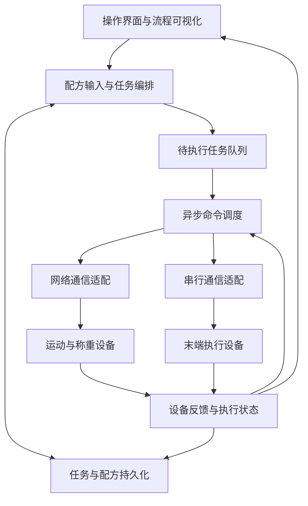

# 架构图：高通量配药设备的上位机

案例关注控制软件的分层，不展示化学配方、设备参数或底层控制实现。根据现有项目说明，上位机采用 C++ / Qt Widgets，围绕事件驱动与异步命令队列连接流程调度和设备通信。图示为抽象整理，未在本次案例编写中重新验证设备行为。

| 层级 | 职责 | 需要明确的边界 |
|---|---|---|
| 交互与可视化 | 展示工位、步骤和异常 | 显示动作与设备真实完成不是同一件事 |
| 业务编排 | 解析输入并组织任务 | 合法输入不等于实验方案已经验证 |
| 调度 | 排队、等待反馈、处理异常 | 不应仅按固定延时推进物理动作 |
| 通信适配 | 将抽象操作映射到设备协议 | 隔离连接状态与业务完成状态 |
| 持久化 | 保存任务与执行记录 | 重启后需要核对现场状态，不能仅靠数据库恢复运动 |

软件案例不构成设备安全认证、配药精度或材料性能声明。
