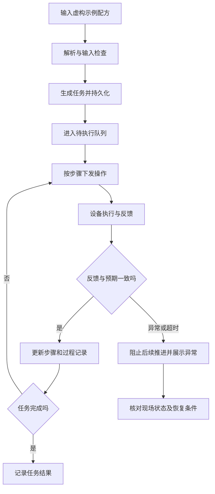

# 数据流：配方任务与设备反馈

上图表达控制系统应核验的反馈闭环；每条异常分支是否覆盖所有设备，需要单独连机验收。

## 三种状态不能混用

| 状态 | 能证明什么 | 不能证明什么 |
|---|---|---|
| 指令已发送 | 通信层已提交请求 | 设备已收到、动作已完成 |
| 设备已反馈 | 收到了设备消息 | 消息一定属于当前动作、实际结果达标 |
| 任务已确认完成 | 上位机完成了规定的步骤检查 | 材料质量或最终实验结果已通过验收 |

演示中应使用“样品 A”“工位 B”等虚构标记，不展示真实实验配方、内部网络配置或项目现场数据。
