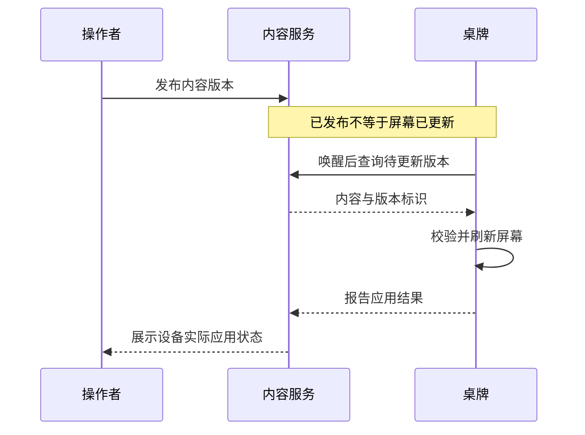

# InkSeat · 墨席 — 低功耗显示系统

**关注问题：设备大部分时间休眠时，怎样兼顾电池寿命、内容更新与可信的状态反馈？**

项目范围沿用已公开的作品介绍：彩色墨水屏桌牌、嵌入式固件、浏览器模板编辑与云端内容分发。以下图示是面向技术交流的抽象方案，不是私有系统的部署拓扑；选型和验证项不表示已经实现或通过测试。

## 架构图

## 数据流与状态边界

## 技术选型对比

| 决策 | 方案 A | 方案 B | 判断依据 |
| --- | --- | --- | --- |
| 更新时机 | 常在线，推送及时，待机开销高 | 周期唤醒，低功耗但存在等待 | 明确业务能接受的更新等待时间，再测整体能耗 |
| 模板加载 | 一次获取全部内容，切换简单 | 列表摘要与按需详情，首屏轻 | 比较模板数量、详情体积及切换频率 |
| 状态判定 | 固定心跳超时，逻辑简单 | 结合预期唤醒周期，状态更准确 | 睡眠、失联和更新失败应分开表达 |
| 内容版本 | 覆盖同一资源 | 不可变版本与设备确认 | 弱网重试、回滚和排障需要可追溯依据 |

## 踩坑总结：设计风险与验证办法

这里整理的是通用风险，不将其包装成未经核实的项目故障履历。

| 风险 | 为什么容易发生 | 处理思路 | 如何验证 |
| --- | --- | --- | --- |
| 正常休眠被显示为离线 | 服务端用在线设备的心跳假设判断低功耗终端 | 展示最后上报与预期唤醒，区分休眠和异常 | 覆盖短休眠、长休眠及连续漏报场景 |
| 点击模板后像是没有响应 | 请求与渲染完成时间不同 | 在画布上反馈加载阶段，错误允许重试 | 限速与请求失败下观察反馈是否及时 |
| 后台成功但屏幕仍是旧内容 | 发布成功被当成应用成功 | 分离发布版本和设备确认版本 | 在下载、刷新及回报阶段分别中断网络 |
| 多次重试导致重复刷新 | 同一内容没有稳定版本标识 | 相同版本采用幂等处理 | 重放同一更新，检查刷新次数与最终内容 |

## Demo 视频

尚未发布。计划展示：使用虚构桌牌信息编辑模板、发布版本、设备唤醒更新、观察确认状态；同时展示一次断网恢复。当前没有公开实机视频或能耗实测，不宣称具体续航和刷新延迟。
