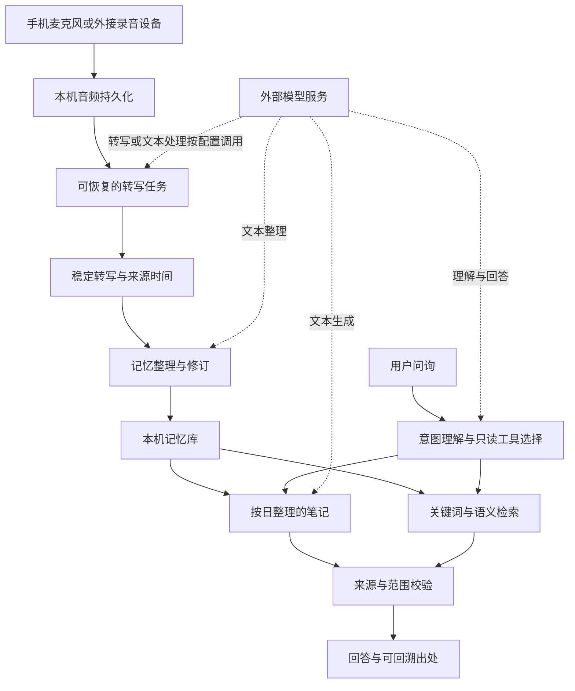

# 架构图：语音如何成为可查询的记忆

设计重点是采集连续性、可恢复处理，以及答案能追溯到资料。持久化和检索在设备端完成；需要文本模型时，按配置将相关文本发送到外部服务，因此不能将整条链路宣传为完全离线。

## 模块边界

| 模块 | 负责 | 边界 |
|---|---|---|
| 采集 | 保存可恢复的音频片段 | 模型请求失败不应直接终止采集 |
| 转写 | 把音频转换成带来源的稳定文本 | 临时识别结果不应直接成为长期事实 |
| 记忆整理 | 提炼事件、待办和可持续更新的信息 | 后出现的句子不一定能覆盖旧事实 |
| 笔记 | 浓缩一段时间内的信息 | 摘要不是逐字稿，也不代表完整细节 |
| 检索 | 返回相关候选、范围和出处 | 召回排名不是事实可信度 |
| 回答校验 | 检查结构、来源和查询覆盖 | 格式正确不等于答案内容真实 |

图中省略了设备标识、私有接口、内部配置及具体部署信息。
