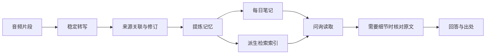
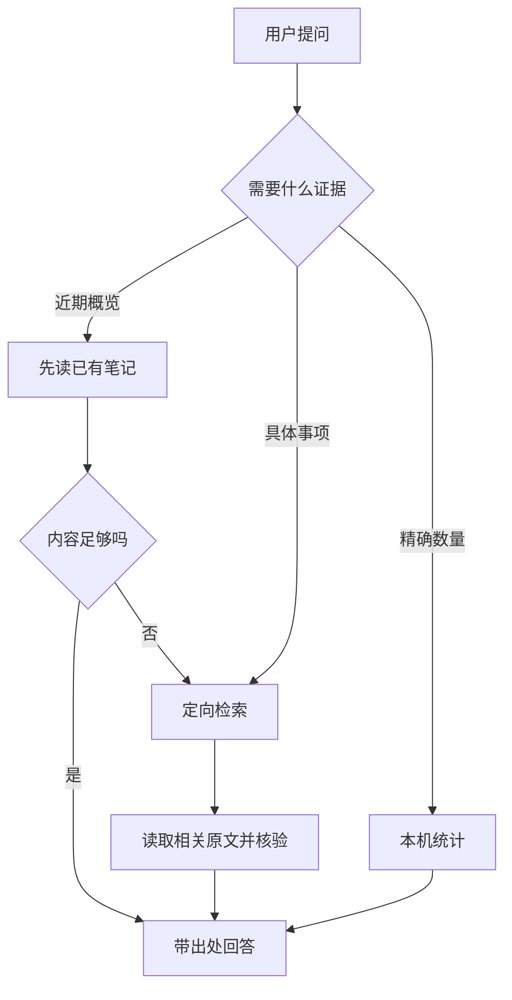
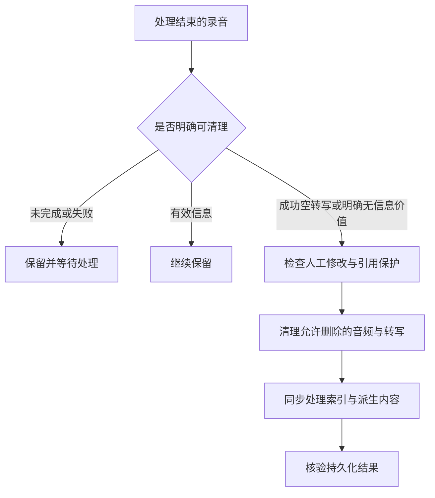

# 数据流：从录音到回答，再到清理

## 正向处理

虚构示例：先记录“下周三交材料”，后记录“改为下周五”。系统需要识别两句是否谈论同一事项，保留变更依据，并区分计划与实际完成状态。

## 问询的读取深度

“没有检索到”不能自动改写成“没有发生”。答复应区分资料不存在、尚未处理、范围不足和查询失败。

## 清理与一致性

没有生成总结或笔记本身不是删除依据。混合录音需要保留有效片段与必要上下文。清理结果需要检查文件和索引，不能仅凭界面条目消失就判定完成。
