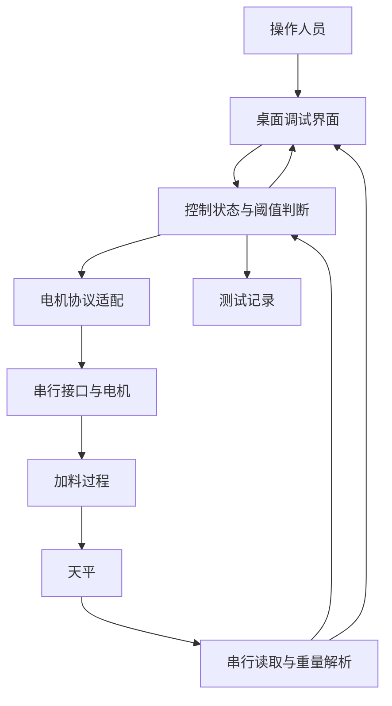

# 架构图：重量反馈驱动的加料调试

根据项目说明，工具使用 Python / Tkinter 提供参数配置、实时监控和测试记录，以天平读数参与电机启停决策。此案例描述软件分层，不公开设备地址、校准值、目标重量和控制指令。

## 隔离职责

| 模块 | 职责 | 不能代替的验证 |
|---|---|---|
| 界面 | 参数输入、状态展示和人工操作 | 设备实际是否安全停止 |
| 控制逻辑 | 基于读数和状态作出继续或停止决策 | 物料流动、落料滞后和最终精度 |
| 电机适配 | 支持不同串行协议 | 不同协议中的单位及行为是否等价 |
| 天平读取 | 获取并解析重量 | 数据是否新鲜、稳定且经过校准 |
| 测试记录 | 保存过程以便比较 | 单次结果能否代表长期稳定性 |

本次仅核对项目描述，未连接设备执行新的称量试验。
