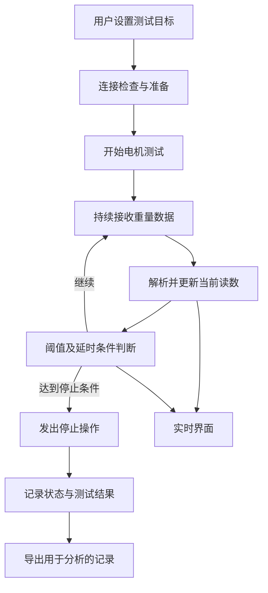

# 数据流：读数、判断、控制与记录

上图是项目说明中的正常处理链路。异常停止、陈旧数据过滤和每种设备协议的确认机制，应通过独立测试核验，不能仅由图示推定已完整实现。

## 观察值和控制结果

“重量达到阈值”“软件发出停止操作”“物料最终停止增加”具有不同时间点。比较策略时需要分别观察；不能用最后一个界面值替代完整过程记录。

公开演示只应展示构造的示例记录或已获准公开的测试结果，不直接发布现场导出的数据文件。
