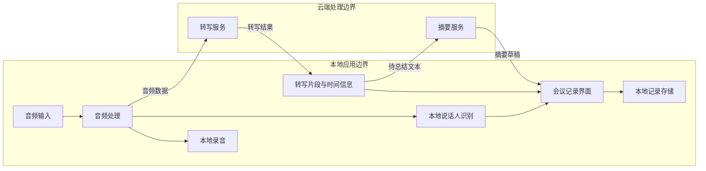
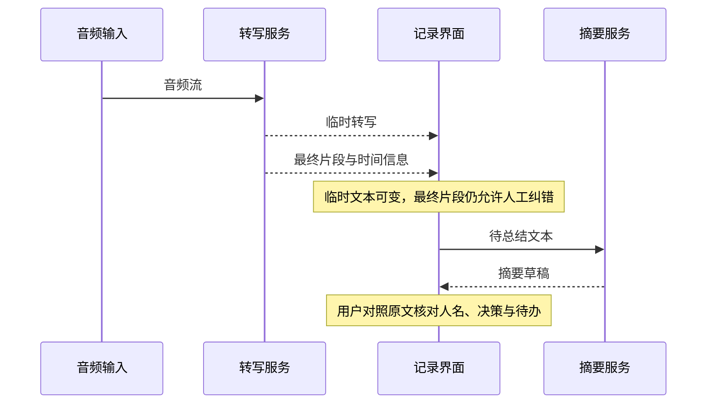

# Shiyin AI · 拾音 — 从音频到可核对的会议记录

**关注问题：如何协调实时转写、本地说话人识别和摘要，同时让用户知道数据去了哪里、结果是否可靠？**

项目范围沿用已公开介绍：Windows 会议应用，本地录音与声纹存储，转写和总结调用云端 API。以下为抽象数据边界与方案比较，不公开服务商配置、模型参数、私有接口或真实会议数据；不表示本次进行了录音端到端验收。

## 架构图

本地保存录音不代表音频不离开设备；云端转写需要传输相应音频。具体保留规则取决于所用服务与配置，本文不作未核实承诺。

## 数据流

## 技术选型对比

| 决策 | 方案 A | 方案 B | 判断依据 |
| --- | --- | --- | --- |
| 转写位置 | 本地：离线能力强，模型和算力成本高 | 云端：接入方便，依赖网络并传输音频 | 数据边界、离线需求、目标机器和运行费用 |
| 说话人识别 | 会话内分离：区分发言者，不知道姓名 | 跨会话记忆：复用身份，需授权与置信度控制 | 误认成本、用户同意和删除能力 |
| 显示策略 | 只显示最终片段：稳定但等待更长 | 临时加最终片段：反馈及时但需要替换逻辑 | 延迟体验、重复片段及断线恢复 |
| 摘要时机 | 会后一次生成：上下文完整 | 分段生成后汇总：过程可见但可能丢跨段联系 | 会议长度、调用限制、引用与核对方式 |

## 踩坑总结：设计风险与验证办法

这些检查点用于说明工程判断，不冒充已发生并解决的事故。

| 风险 | 原因 | 处理思路 | 验证 |
| --- | --- | --- | --- |
| 临时和最终文本同时保留 | 将更新事件当作新增事件 | 用稳定片段身份替换，明确结束状态 | 重复、乱序与断线后的事件回放 |
| 第一段转写遗漏 | 初始化事件与首段结果的顺序假设过强 | 分开处理会话就绪和片段数据 | 覆盖首段快速结束和空临时结果 |
| 跨会议错误沿用姓名 | 把低置信度匹配当成确定身份 | 保留未知发言者，允许人工确认与纠正 | 不同麦克风、噪声、相似声线及新说话人 |
| 摘要编造结论或责任人 | 模型补全了原文没有的信息 | 显示为草稿，支持回看对应原文 | 用含歧义、否定及未决事项的虚构会议核对 |

## Demo 视频

尚未发布。计划使用专门录制的虚构会议，展示实时文字更新、发言者纠错、摘要核对和数据删除。发布前应取得参与者同意；不上传真实会议录音、声纹或账号信息。
